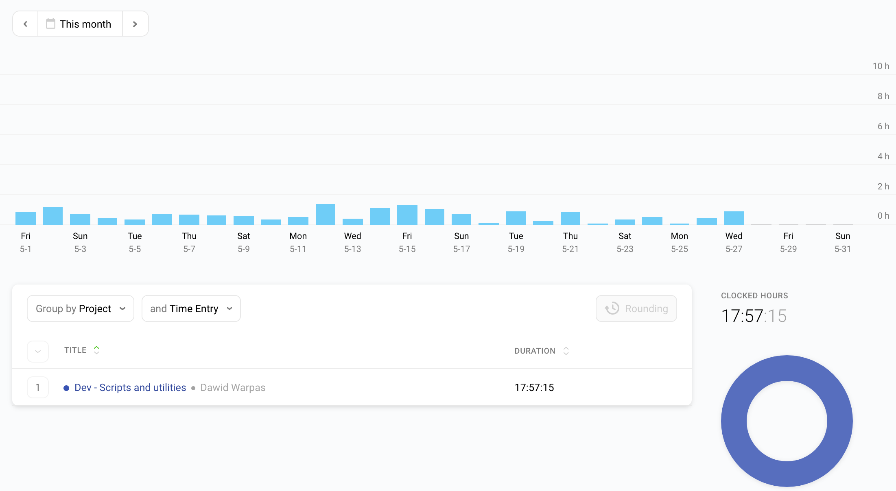

# Need a push to work on your side project? Try DK30!
#system #post/published

Do you like to talk to people about your exciting new idea, and then never do anything about it? I’m certainly guilty of that.

Do you like to make promises to people that have a deadline attached to them? I try to avoid doing that because I don’t like to disappoint.

Would you promise someone to complete a long project that you don’t have the time for, and then commit to a deadline? I have been sure to avoid that for most of my adult life!

I don’t think I have a healthy relationship with deadlines. I took everything I liked out of the mountains of productivity advice. I didn’t like introducing accountability into my life voluntarily. But that’s a story for another time. Something changed recently and I went out of my way to commit publicly to working on one of my side projects. I joined a DK30 event and promised to work on a side-project for the following 30 days.

Please grab a cup of your favourite beverage and join me in exploring how you could benefit from joining DK30.

### What is DK30?

Seth Godin wrote 10 years ago about the [importance of heroes over mentors](https://seths.blog/2010/10/heroes-and-mentors/). I have a sizeable list of people I look up to and consider my heroes. One of the first people to land on that list is a guy called [Sean Plott](https://en.wikipedia.org/wiki/Sean_Plott). If you’ve ever been interested in the esports scene for Starcraft 2, chances are you’ve heard his online nickname - “Day[9]”. He’s been a caster/commentator for the game, well known for his positivity. Nowadays he [streams various games](https://day9.tv/) and spins off quirky side-projects. One of those projects is [the website for DayKnight 30 day projects](https://day9.tv/dk30-about) - DK30 for short.

I came across that site at a fortunate point in time. I’ve already described how I started working on my side-project in an [earlier post](https://warpas.github.io/20200520_post.html). I’ve joined DK30 some 2 weeks after starting and my DK30 project was to keep up the commits for the next 30 days. I wanted to document my progress every day to keep up my initial excitement. I ended up doing it as planned. Some days were awesome - I sat down to do 1 commit and ended up pulled into interesting parts of the project and working for 1-2 hours with useful results at the end. Some other days were the opposite - all I did was adding a couple of lines to the Readme file. But the goal was to do something, anything every day. If you’re interested, the whole project with short daily updates is described [here](https://day9.tv/dk30/project/5ea88325015a1b2db108d0ef).

### What was the result?

These DK30 events are designed to be that little extra push for you to get started on a project you care about but never seem to find the time for. It was the first time I heard about it and I’m honestly surprised by the results.  The whole experience was engaging and surprisingly effective from my perspective. It even had a twist I would have never expected.

At the end of the DK30 Quarantine Edition, Sean sat down to review a few of the projects from the event on his stream. I was stunned to see that he picked my project as an example and [discussed it for about 2,5 minutes](https://www.youtube.com/watch?v=ImKcgkl_g2s&feature=youtu.be&t=803). I had a little fanboy moment and received good feedback from it.

(https://www.youtube.com/watch?v=ImKcgkl_g2s&feature=youtu.be&t=803)

If you’re on the fence about working on a project you care about but never seem to find the time, try the following. Cut the scope down as much as you can. If it’s a 6-month project, how about finding a part of it that could be done in a week? My DK30 project was about consistency. Doing small, incremental parts over 30 days. Would that work for you? If you have an idea and need that extra push, you don’t need a big event to start. The “[New project](https://day9.tv/dk30/project/new)” button is right there on the DK30 page for you to use. Feel free to share it with me at the blog email address - contact@warpas.blog
